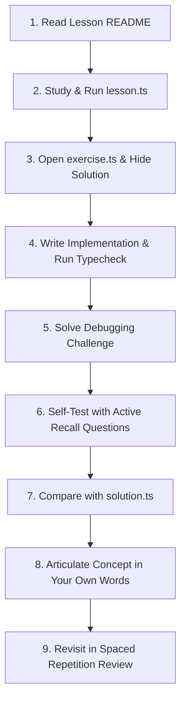

# TypeScript Mastery: From Foundations to Advanced Type Engineering

> **Current Stable TypeScript Target**: `TypeScript 7.0.x / 5.8+` (Strict Mode Enabled)  
> **Course Architecture**: 26 Progressive Modules + Capstone Project + Interview Track + 7-Part Final Assessment

---

## What This Repository Is

This repository is a **serious, structured, self-contained TypeScript mastery course** designed to take you from a developer with foundational JavaScript and Python knowledge to an **engineer capable of architecting, debugging, and leading production TypeScript systems**.

This is **not** a documentation dump, nor is it a toy tutorial with 100 shallow pages. Every module combines:
1. **Conceptual depth** (mental models, runtime vs compile-time behavior, why the feature exists).
2. **TypeScript vs JavaScript deep comparisons**.
3. **Executable lessons** with realistic production code.
4. **Hands-on exercises** with isolated problems, hints, solutions, and architectural explanations.
5. **Debugging challenges** derived from real-world compiler errors.
6. **Technical interview preparation** with weak vs strong answers and follow-up probes.
7. **Active recall and spaced repetition** triggers.

---

## Who This Is For

- Developers coming from **Python, Go, Java, or C++** who understand programming fundamentals but need to master TypeScript's structural type system.
- Developers with **some JavaScript exposure** who want to build a deep, rock-solid understanding of JS runtime semantics before and alongside TypeScript.
- Engineers preparing for **mid-level, senior, or staff TypeScript technical interviews**.
- Developers working in **React, Next.js, Node.js, and library ecosystems** who are tired of fighting the compiler with `any` or loose type assertions.

---

## Repository Architecture & Progression

| Level | Topic | Description & Focus | Difficulty |
| :--- | :--- | :--- | :--- |
| **00** | [JavaScript Foundations](./00-javascript-foundations/) | Ground zero variables (`const`/`let`), functions & syntax, primitives vs references, closures, scope, prototypes, `this`, and event loop. | [ESSENTIAL] Essential |
| **01** | [Fundamentals](./01-fundamentals/) | Compile-time vs runtime, inference, annotations, arrays, tuples, unions, literals, `any` vs `unknown` vs `never`. | [ESSENTIAL] Fundamental |
| **02** | [Type System Deep Dive](./02-type-system-deep-dive/) | Structural typing, assignability, excess property checks, narrowing, discriminated unions, variance. | [INTERMEDIATE] Intermediate |
| **03** | [Functions](./03-functions/) | Function signatures, overloads, `this` parameters, type predicates, callbacks, and typed error handling. | [INTERMEDIATE] Intermediate |
| **04** | [Interfaces & Type Aliases](./04-interfaces-and-types/) | Interface vs Type deep dive, declaration merging, index signatures, recursive types. | [INTERMEDIATE] Intermediate |
| **05** | [Generics](./05-generics/) | Type parameters, constraints (`extends`), inference, preserving relationships, generic repositories. | [ADVANCED] Core Master |
| **06** | [Advanced Types](./06-advanced-types/) | `keyof`, `typeof`, indexed access, mapped types, conditional types, `infer`, template literals, branded types. | [EXPERT] Advanced |
| **07** | [Built-in Utility Types](./07-utility-types/) | Re-implementing `Partial`, `Pick`, `Omit`, `Record`, `Exclude`, `Extract`, `ReturnType`, `Awaited`, etc. | [ADVANCED] Core Master |
| **08** | [Classes & OOP](./08-oop/) | Access modifiers, parameter properties, abstract classes, composition vs inheritance in TS. | [INTERMEDIATE] Intermediate |
| **09** | [Modules & Project Setup](./09-modules/) | ESM vs CJS, type-only imports/exports, module resolution, barrel files. | [INTERMEDIATE] Intermediate |
| **10** | [TSConfig & Compiler](./10-tsconfig/) | Compiler flags: `strictNullChecks`, `noUncheckedIndexedAccess`, `exactOptionalPropertyTypes`, emit flags. | [INTERMEDIATE] Intermediate |
| **11** | [Runtime vs Type System](./11-runtime-vs-types/) | Type erasure, boundary validation, schema parsing, why TS cannot validate runtime fetch. | [ADVANCED] Core Master |
| **12** | [Error Handling & External Data](./12-error-handling/) | `unknown` in catch blocks, Result/Either patterns, boundary validation. | [ADVANCED] Core Master |
| **13** | [Async TypeScript](./13-async/) | `Promise<T>`, typed fetch, `Promise.allSettled`, concurrent async pipelines. | [INTERMEDIATE] Intermediate |
| **14** | [Type-Safe API Design](./14-api-design/) | Request/response DTOs, query contracts, generic client patterns. | [ADVANCED] Core Master |
| **15** | [TypeScript with Node.js](./15-node/) | Clean service/controller/repository architecture, environment config validation. | [ADVANCED] Core Master |
| **16** | [TypeScript with React](./16-react/) | Props, hooks, discriminated union state machines, generic components, event typing. | [ADVANCED] Core Master |
| **17** | [TypeScript Design Patterns](./17-design-patterns/) | Discriminated state machines, Builder pattern, Strategy, Result Monad. | [EXPERT] Advanced |
| **18** | [Code Reading](./18-code-reading/) | Reading unfamiliar generic and conditional codebases, predicting types. | [EXPERT] Advanced |
| **19** | [Refactoring JS to TS](./19-refactoring/) | Step-by-step transformation of messy JS into safe, strictly typed TS without `any`. | [ADVANCED] Core Master |
| **20** | [Debugging TypeScript](./20-debugging/) | Diagnosing compiler errors: narrowing failures, generic mismatch, excess property traps. | [EXPERT] Advanced |
| **21** | [Testing TypeScript](./21-testing/) | Compile-time type assertions (`Expect<Equal<A, B>>`) and runtime test suites with Vitest. | [ADVANCED] Core Master |
| **22** | [Capstone Project](./22-project/workflow-compliance-engine/) | Full production-grade Workflow & Compliance Engine with typed contracts, validators, and engine tests. |  Capstone |
| **23** | [Interview Track](./23-interview/) | Categorized Beginner, Intermediate, and Advanced interview questions with weak vs strong answers. |  Career |
| **24** | [Coding Interview Track](./24-coding-interview/) | Data structures & algorithms in TypeScript: LRU Cache, Type-Safe Event Emitter, BST, Trie. |  Career |
| **25** | [Final Assessment](./25-final-assessment/) | 7-part comprehensive evaluation: Conceptual (50), Prediction (20), Debugging (10), Implementation (10), Advanced (10), Architecture, Mock Interview. |  Certification |

---

## Quick Start & Tooling Setup

This course uses modern Node.js and TypeScript with zero-config test running via `vitest` and `tsx`.

### 1. Install Dependencies
```bash
npm install
```

### 2. Verify Your Environment
```bash
npm run typecheck
```
This runs `tsc --noEmit` across all lessons, exercises, tests, and solutions.

### 3. Run the Test Suite
```bash
npm test
```
Runs all unit tests, type-level tests, and capstone project tests.

### 4. Run the Capstone Project
```bash
npm run project:run
```

---

## The 9-Step Study Workflow

To maximize long-term retention and avoid passive skimming, follow this loop for every lesson:



1. **Read the Concept**: Study the mental model, why the feature exists, and what problem it solves.
2. **Execute Examples**: Run `npx tsx <path>/lesson.ts` and inspect runtime vs compile-time behavior.
3. **Close the Solution**: Open `exercise.ts`. Do not look at `solution.ts`.
4. **Implement**: Write your types and functions. Run `npx tsx <path>/exercise.ts` or `npm run typecheck`.
5. **Debug**: Diagnose the compiler failure in the debugging challenge.
6. **Active Recall**: Answer the 5-minute recall questions out loud or in writing before expanding the answers.
7. **Review the Solution**: Read `solution.ts` and study the "Better Solution" and architectural trade-offs.
8. **Synthesize**: Note down one key insight in your own words.
9. **Update Progress**: Mark your mastery level in [`PROGRESS.md`](./PROGRESS.md).

---

## File Structure in Each Module

Every lesson folder follows a uniform, predictable layout:

```text
module-name/
├── README.md       # The 14-step learning guide (Concept, Mental Model, Mistakes, Interview, Recall)
├── lesson.ts       # Executable, strictly typed real-world code walkthrough
├── exercise.ts     # The student challenge with TODOs and type constraints
└── solution.ts     # Reference solution, explanation, and architectural trade-offs
```

---

## The "Why Not `any`?" Rule

Throughout this entire course, whenever you are tempted to reach for `any`, we apply the **3-Question Guard**:
1. *What information is `any` discarding?*
2. *Can `unknown` force safe runtime validation at the boundary instead?*
3. *Can a generic parameter `T` preserve the relationship between inputs and outputs?*

---

## Tracking Progress

Open [`PROGRESS.md`](./PROGRESS.md) to check off topics as you advance:
- [NOT STARTED] Not Started
- [INTERMEDIATE] Learning
- [PRACTICING] Practicing
- [ESSENTIAL] Comfortable
-  Mastered

Let's begin! Start at [Level 00: JavaScript Foundations Needed for TypeScript](./00-javascript-foundations/).
